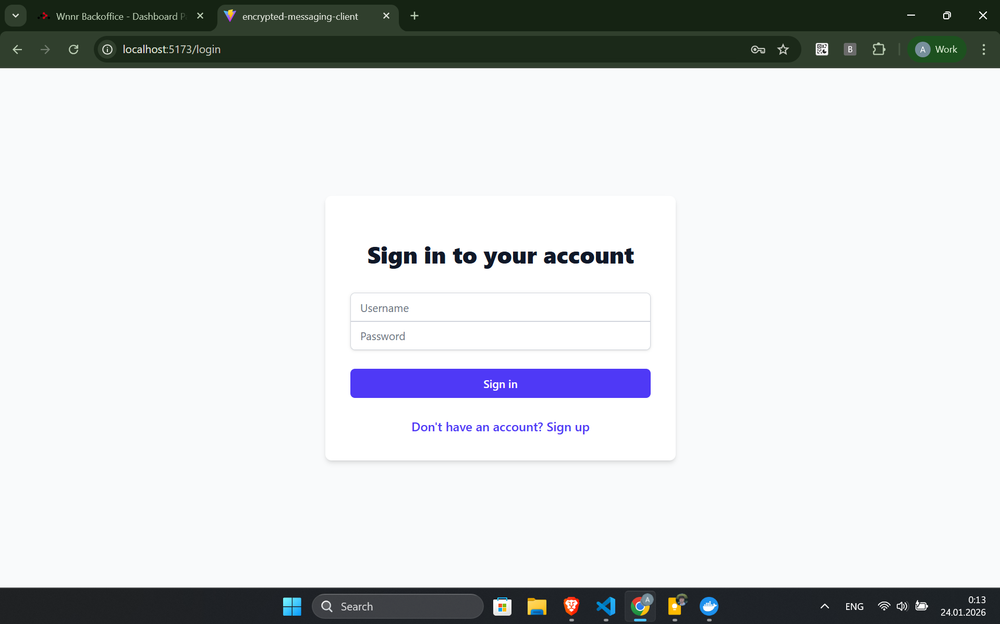
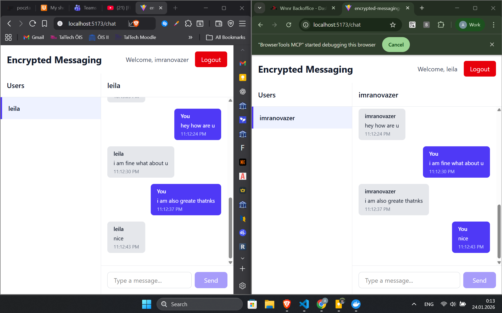

# Encrypted Messaging App

A simple chat app where messages are encrypted before they leave browser. The server never sees what is written by user only saves encrypted data. Only you and the person you’re chatting with can read it.

## What it does

You register, log in, pick a user, and send messages. Each message gets encrypted on your device, sent to the server as ciphertext, and decrypted only on the recipient’s device (and yours, so you can re-read what you sent).

## Demo

<p>
  
  
</p>

## Encryption & decryption

Here I use hybrid encryption RSA and AES. RSA is used to encrypt AES keys and AES keys are used to encrypt message itself. We don't use RSA for encyrpting message directyl as it is slow and not good in encrypting long messages, but AES is fast and hadle big messages encryption good.

When message sent:

1. The app generates a random AES key and encrypts message with it. Each new message have random AES key.
2. That AES key is then encrypted with the recipient’s RSA public key which is stored in db user's data (and optionally yours, so you can decrypt your own messages later).
3. The server receives: encrypted message + encrypted AES key(s). It has no way to decrypt them.

Message body :

```
export interface MessageDto {
  id: string;
  senderId: string;
  recipientId: string;
  sender: { id: string; username: string; };
  recipient: { id: string; username: string; };
  encryptedContent: string;
  encryptedAesKey: string;
  senderEncryptedAesKey: string | null; (Later to encrypt message for ourself with out private key)
  timestamp: Date;
}
```

When someone receives a message:

1. Their app uses their RSA private key to decrypt the AES key.
2. Then it uses that AES key to decrypt the message.
3. Plain text appears only in the browser—never on the server.

So: **AES encrypts the message, RSA encrypts the AES key.** Hybrid encryption, done in the browser.

## Why it’s secure (besides encryption)

- **Passwords** are hashed with bcrypt—the server never stores your actual password.
- **Auth** uses JWT tokens; user need a valid token to hit protected routes and connect via WebSockets.
- **Private keys** stay in user's browser (e.g. localStorage); only public keys are sent to the server. An encrypted backup of your private key (locked with your password) can be stored on the server so you can restore it on another device or after clearing storage.
- **WebSockets** are authenticated with the same JWT, so only logged-in users get real-time updates.

## Key backup & restore

If you clear localStorage or log in from another device, your private key is gone and you can’t decrypt messages. To fix that, we back up your private key in a **password‑encrypted** blob on the server.

On **register**, the app encrypts your private key with your password (PBKDF2 + AES‑GCM) and sends that blob to the server. The server stores it but never sees the raw key or your password. On **login**, we send the blob back; the client decrypts it with your password and saves the key in localStorage again. So you can use the app from any device—or after clearing storage—as long as you have your password.

If you’re already logged in but keys are missing (e.g. you cleared storage), the chat page shows a **“Restore keys”** form. Enter your password, we fetch the backup, decrypt it, and you’re back to reading messages. Old accounts created before this feature have no backup; they keep the previous behaviour (keys only in localStorage).

## JWT & cookies

I’d have preferred **httpOnly cookies** for the JWT to reduce XSS risk, but wiring that up with **Socket.IO** (sending the token on connect, same-origin, etc.) was hard for this project. So the token lives in `localStorage` for now. Something to improve later.

## Tech

React (Vite) + NestJS, PostgreSQL, Socket.IO. Crypto: RSA (node-forge) + AES-GCM (Web Crypto API).

## How to run

1. **Start PostgreSQL** (Docker):

   ```bash
   docker-compose up -d
   ```

   Uses default `postgres` / `postgres` and DB `encrypted_messaging` on port 5432.

2. **Run the API**:

   ```bash
   cd server && npm install && npm run start:dev
   ```

   Server runs at `http://localhost:3000`.

3. **Run the client**:

   ```bash
   cd encrypted-messaging-client && npm install && npm run dev
   ```

   App runs at `http://localhost:5173`. Open it in the browser, register, then chat.

Optional: set `VITE_API_URL` (and `FRONTEND_URL` on the server) if you use different hosts or ports.
